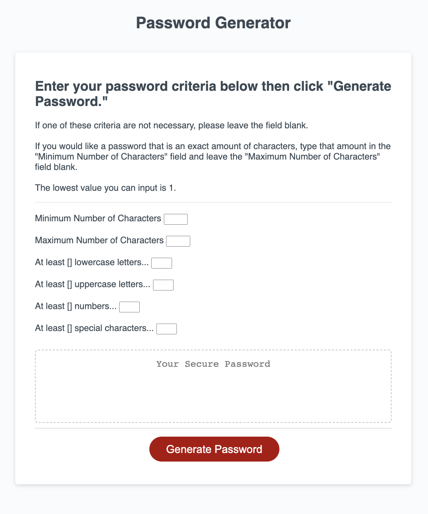

# Password Generator 

## Description 

This purpose of this repository is to refactor code for a Password Generator. The scenario given was that this is a password generator used by employees with access to sensitive data. The application must be able to generate passwords that meet certain criteria input by the user. The purpose of this application is to create strong passwords to provide greater security. 

## Installation 

N/A

## Usage

When you need a new, secure password, enter the following URL into any browser: 

You will see a landing page that looks like the following: 

You will be presented with a series of prompts regarding your password criteria. As you can see on the screenshot, you can enter information for the following criteria: 

- Minimum character length (if any)
- Maximum character length (if any)
- Number of lowercase letters required (if any)
- Number of capital letters required (if any)
- Number of numeric characters required (if any)
- Number of special characters required (if any)

You may choose to enter values for all of these criteria, only a few, or only one. The button will not work, however, if you do not enter anything in the password criteria prompts. 

After entering your desired amount of criteria, an output message will appear written in the box above the button. You can then copy/paste that ouput and use it as your new password!

## Additional Usage Notes

1. If you enter a minimum character count value that is larger than the maximum character count value, you will receive a logic error message and be asked to fix your criteria. 
2. If you enter "1" in the maximum character count, you will receive a message that having a 1 character password is not secure. You will be asked to fix your criteria and try again. 
3. If you ONLY enter a "1" in the minimum character count you will receive the same message about a 1 character password. 
4. If you ONLY enter values in the minimum or maximum character count prompts then the Password Generator will generate a password to meet that character count using an array of mixed lowercase letters, uppercase letters, special characters, and numbers (called "all" in the code).
5. If you ONLY enter values in the parameter prompts other than those regarding character count, the Password Generator will generate a password that meets those criteria exactly. 
6. If you enter a minimum value and parameter prompts, the Password Generator will first create a string that meets your parameters. Then, it will create a random string using the "all" array to meet the remaining character count. It will output the concatenation of the first string and the second. 
7. If the minimum character count value is equal to the maximum character count value, the Password Generator will function as it does in Note 6. Unless they are both equal to 1. Then the Password Generator will function as it does in Note 2.
8. If you enter a maximum value and parameter prompts, the Password Generator will function as it does in Note 5. Unless, the length of the password generated from the prompts is larger than the entered maximum character count. For example, if you entered that you need 2 uppercase letters and 2 special characters, and a maximum character count of 3. This will result in an error message. You will be asked to fix your criteria and try again. 

## Technology Used

GitHub, Git, HTML5, CSS3, JavaScript

## Learning Points 

- Connecting user input to variables in JavaScript
- Using a "for" loop and adding the value at the end of each iteration of the loop to an exisitng array
- Creating randomness in JavaScript, and learning about the lack of true randomness
- Learning about different methods for shuffling arrays, including the Fisher-Yates shuffle

## User Info

Created by Laura Duffy (@ GitHub) for the UC Berkeley Extension, Full Stack Coding Bootcamp.

## License 

Please refer to LICENSE in GitHub repository. 

## How to Contribute

Find a bug!? Feel free to reach out! Just make sure to follow the Contributor Covenant!

Email: LauraDuffy700@gmail.com

GitHub: github.com/duffylaura
